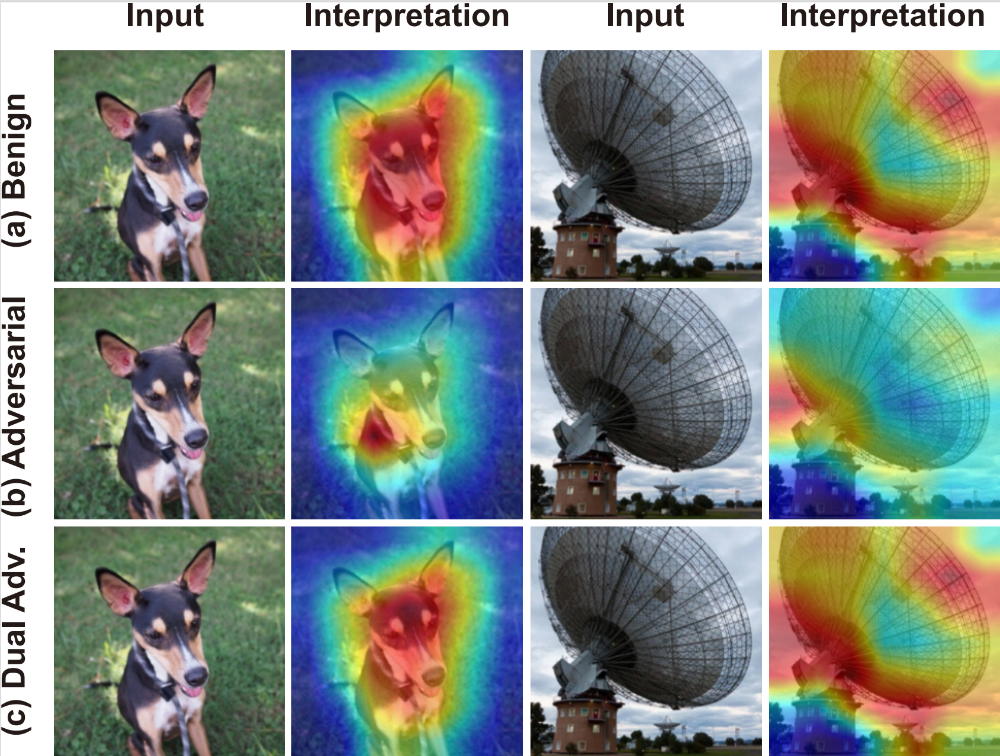

# AdvEdge-Attack

Deep learning methods have gained increased attention in various applications due to their outstanding performance. For exploring how this high performance relates to the proper use of data artifacts and the accurate problem formulation of a given task, interpretation models have become a crucial component in developing deep learning-based systems. Interpretation models enable the understanding of the inner workings of deep learning models and offer a sense of security in detecting the misuse of artifacts in the input data. Similar to prediction models, interpretation models are also susceptible to adversarial inputs. This work introduces two attacks, AdvEdge and AdvEdge+, that deceive both the target deep learning model and the coupled interpretation model. We assess the effectiveness of proposed attacks against four deep learning model architectures coupled with four interpretation models that represent different categories of interpretation models. Our experiments include attack implementation using various attack frameworks. We also explore the attack robustness against three general defense mechanisms and the potential countermeasures against such attacks. Our analysis shows the effectiveness of our attacks in terms of deceiving the deep learning models and their interpreters, and highlights insights to improve and circumvent the attacks.




## Dependencies

This project requires the following Python packages:

- torchvision
- torch
- PIL (Pillow)
- argparse
- os
- glob
- numpy
- random
- shutil
- cv2 (OpenCV)
- scipy
- math
- copy
- re
- collections
- time
- skimage
- matplotlib

You can install these packages using pip:

```bash
pip install torchvision torch pillow argparse numpy opencv-python scipy matplotlib scikit-image
```

**Note**: Some of these packages (like os, glob, random, shutil, math, copy, re, collections, and time) are part of the Python Standard Library and do not need to be installed separately.

## Data

The data used in this project is provided in `.npz` format. NumPy's `.npz` format is a file format that allows you to save several arrays into a single file on disk.

## Code

The code for this project is provided in Jupyter notebooks.


